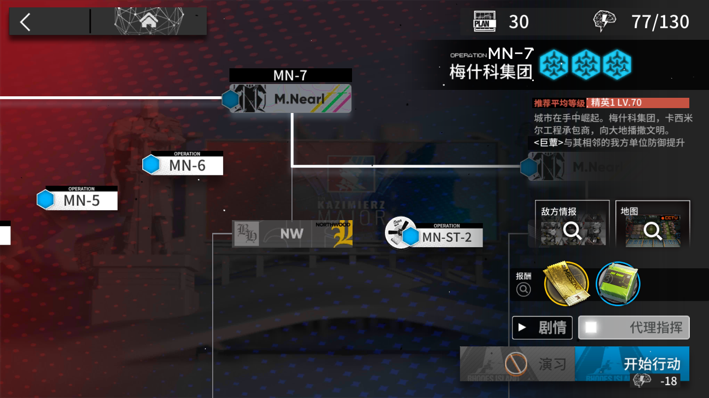

# AUTOARK
Auto daily activity program of Ark-Nights with OpenCV, MuMu simulator adb and Baidu API.

## Configuration

1. Python3
2. OpenCV
```
pip install opencv-python
```
3. Baidu API
```
pip install baidu-aip
```

## Setup in Windows10
Dowload this code and unzip into your path.
Open cmd and enter the local path by commanding:
```
>/your local path/[for example my path is D:\AUTOARK-master]
```


#### Install baidu API

Sign up an account of [Baidu API](https://login.bce.baidu.com/), it is free.
Check the documents to apply the [ocr](https://cloud.baidu.com/doc/OCR/index.html) and [image search](https://cloud.baidu.com/doc/IMAGESEARCH/index.html) application. 
After successful applying the OCR and image search API, copy 3 keys and paste them to these lines in 2 files (\AUTOARK-master\baidulib\ocr.py & \AUTOARK-master\baidulib\img_search.py).
```
config = {
    'appId': 'your id ********',
    'apiKey': 'your key ************************',
    'secretKey': 'your key ********************************'
}
```

#### Get start
1. Open MuMu simulator.
2. Run the `adb_init_connect.py` in cmd
```
python adb_init_connect.py
```
  In this file line6 _127.0.0.1:7555_ is the id for [MuMu](https://mumu.163.com/) simulator, please convert it to your simulator's id before running this file.

3. Make sure to enter the main interface of the game.

4. Run the spcific function file by python command. For example, buy the credit store's goods by commanding:
```
python shop.py
```
  Or return to home interface from anywhere in the game by commanding:
```
python returnhome.py
```
#### Preview



and more..

